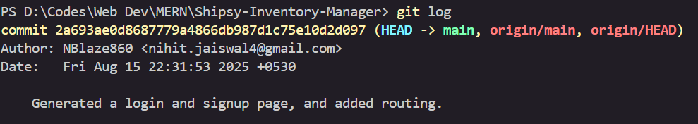

# Commits

## Commit 1 :

## Commit 2 :

## Commit 3 :

## Commit 4 :

## Commit 5 :

## Commit 6 :

## Commit 7 :

## Commit 8 :

## Commit 9 :

## Commit 10 :

## Commit 11 :

## Commit 12 :

## Commit 13 :
